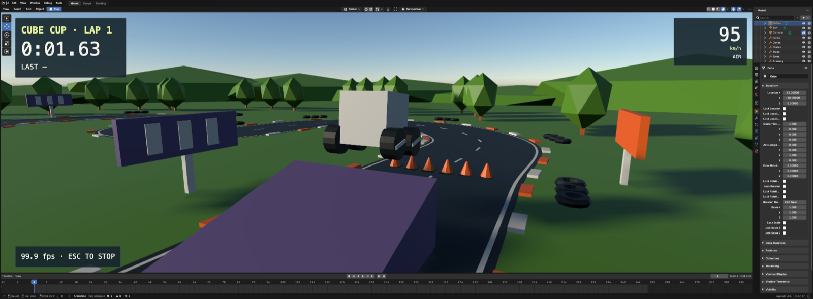

# Cyclotron by videogame.ai



A free, open-source game editor by videogame.ai, built from Blender 5.2 compiled to WebAssembly, Code-OSS, three.js, TypeScript and React.

On Windows, open PowerShell and paste:

```powershell
irm https://cyclotron.videogame.ai/install.ps1 | iex
```

On a Mac with Apple Silicon, or Linux on x64, open Terminal and paste:

```bash
curl -fsSL https://cyclotron.videogame.ai/install.sh | sh
```

- Nothing else to install. The line uses your Node.js 24 or later if you have it, or downloads
  Node.js 24 from nodejs.org (checked against its published SHA-256) into `~/.volter/node`.
  It makes the starter racing game at `~/Cyclotron/my-race` and opens it in your browser; paste
  the same line again to reopen it. With Node.js 24 already, the same is
  `npx @volter/cyclotron create my-race --template playable` (on Windows, in Command Prompt:
  PowerShell's default policy refuses npm's `npx.ps1`). To change the editor itself, see
  [Building from source](#building-from-source).
- To try it without installing, open [cyclotron-web.videogame.ai](https://cyclotron-web.videogame.ai/):
  the editor with Blender and Play in your browser, without Chat.
- Opens Canyon Comet, a kart race through a desert canyon modelled in the editor. Press
  **Play** in the Game panel below the viewport: the camera moves from your editing view to the
  chase camera behind your kart. Press **RACE!** (or Enter, or an arrow key) and, after a three-second
  countdown, race five rivals over three laps: arrow keys or W/S to drive, Space to drift,
  Shift to boost with collected coins. **AUTO** in the HUD, or **Autoplay** in the Game panel,
  lets a bot drive your kart. Escape moves the camera back and returns the untouched model. A
  lap takes about 12 seconds.
- `src/models/canyon.blend` is the scene and `src/models/canyon.py`, with the step scripts
  beside it, the bpy that built it; `src/models/canyon.play.ts` is the script Play runs, and
  `src/ui/` is the React interface drawn over it.
- In the Chat pane, one click opens Sign in with ChatGPT, or Chat runs the coding agent you
  already have (Codex or Claude Code; others from its agent picker). The editor adds no
  account and bills nothing.
- Three first things to ask the agent, one per file:

  ```text
  Write src/models/palms.py to plant five palm trees on the sand outside the start straight, clear of the road. Open Canyon, run the script through the project's Blender MCP, and save canyon.blend.
  ```

  ```text
  Edit src/models/canyon.play.ts so a coin boost lasts 2 seconds instead of 1.4 and raises top speed to 38 metres per second instead of 33. Keep drift boosts unchanged.
  ```

  ```text
  Edit src/ui/race-hud.tsx to show your speed in km/h at the bottom centre, above the controls line. Keep the circuit map on the right.
  ```
- `npx @volter/cyclotron create my-models` makes a plain modelling project with a cube.

For modelling, run `npx @volter/cyclotron` with no arguments. Inside an existing
project it opens that project. Elsewhere it creates a ready cube project at
`~/Documents/Volter Models/Untitled Model` and opens it with Chat alongside the
viewport. Later launches reopen that starter with your edits intact; an occupied
unrelated folder is preserved and a numbered folder is used instead.

## Chat and your agent

Chat uses the agent already signed in on your machine: it starts Codex or Claude Code by
itself when it finds one installed and signed in, resuming the project's last conversation
with the agent that held it. With none, Chat shows one button, **Sign in with ChatGPT**. It
installs OpenAI's Codex from its official npm package (`@openai/codex`) when Codex is
missing, then opens Codex's ChatGPT sign-in in your browser, and the chat opens once you're
signed in ([docs/CHAT-WELCOME.md](docs/CHAT-WELCOME.md)). Until a coming Chat release removes
it, the welcome also shows Sign in with Claude, which does the same for Claude Code
(`@anthropic-ai/claude-code`). Chat checks readiness and
reconnects without a reload. Other agents Volter Harness supports (Gemini, Grok and more) can
be chosen from Chat's agent picker.

Other extensions install from the **Extensions** view; Claude Code's official extension is
`@id:Anthropic.claude-code`. No agent extension is bundled.

Every Cyclotron project declares the Blender MCP server in both `.mcp.json` and
`.codex/config.toml`, with the same command. Codex loads it once you
[trust the folder in Codex](https://learn.chatgpt.com/docs/config-file/config-basic).
Creating a project never writes to your global `~/.codex`.

New projects include `AGENTS.md` with the model workflow and `CLAUDE.md` importing
it. Both agents receive the same guidance for inspecting the live scene, updating
scripts, using Blender MCP and verifying the saved model.
The defaults also require an in-scene supplied or generated reference, regular
visual comparison, live gameplay with an autoplay/demo controller, and React
game UI shown in the editor's UI canvas and in Play.
The agent derives appearance and requirements from supplied images, videos,
specifications and existing assets. For a new game, it first matches a static
scene and React UI screenshot to the reference, including framing and display
colors, before implementing gameplay. These workflows come from the project
defaults rather than a detailed user prompt.

Another agent can drive the conversation already visible in Chat, from the
project directory:

```bash
npx --no-install cyclotron chat status
npx --no-install cyclotron chat send "Make the cube blue with softly rounded edges."
npx --no-install cyclotron chat stop
```

These commands use the native Chat and its Supercode runtime, retain the person's
draft, and keep prompts and replies in the same transcript. `send` requests a
native Chat submission and returns `submissionRequested: true` with
`submissionConfirmed: false`. This action returns before submission settles, so
its receipt does not establish that a turn started. `status` reports the native session ID,
busy state and pending requests. Finish approvals in Chat; sending another prompt
while a turn or request is pending is refused. Choose the agent/model or complete
sign-in in the editor before sending when Chat is not ready.

## Working in a project

```bash
cd my-race
npm run dev
```

From the project directory, `npx --no-install cyclotron` provides (the unscoped npm package `cyclotron` is not ours; `--no-install` runs the project's own copy):

- `edit` opens the project;
- `status` reports the session;
- `console` reports unresolved diagnostics;
- `eval` drives the editor's automation API;
- `blender-mcp` serves the Blender MCP interface over stdio;
- `close` stops the session.

`edit` prints the editor's address, `http://editor-<id>.localhost:<port>/?project=<name>`: each
project has its own host (a stable hash of its folder), and `http://127.0.0.1:<port>/` redirects
there. A tool that drives the editor in a browser binds that printed host and reuses its tab;
binding `127.0.0.1:<port>` opens a fresh tab each time, the editor yields the previous one, and
tabs pile up. Running `edit` again prints the same address and focuses the open tab. See
[CHANGELOG.md](CHANGELOG.md) (0.5.190).

MCP initialization does not start Blender; the first scene request attaches to or opens the
project's editor. Append `--existing-session` after `blender-mcp` to require an editor that
is already open.

Modelling edits save to the project's `.blend` file. Undo and Redo go through the editor's
history, and Blender keeps the snapshots; redo never reruns a script. History lasts for the
session and resets when another `.blend` opens. An arbitrary Python execution counts as an
edit, even one that fails part-way, so use the inspection tools for read-only queries.

To move a project to a new release, from whichever version it is on, run this in its folder:

```bash
npx @volter/cyclotron@latest upgrade
```

It moves the project's `@volter` packages and `volter.project.json`'s `engine.version`
together, and prints what to run next (`npm install`, then reopen the editor). The product
then downloads the matching workbench. Name `@latest`: in a project, a plain `npx @volter/cyclotron`
runs the project's own installed version, and a project made before 0.5.203 needs the newest
release's `upgrade` to move it to the renamed packages and the `editor/` folder.

## Package map

The npm scope is `@volter`. Install one product; its supporting packages come with it.

| Package | Responsibility |
| --- | --- |
| `@volter/cyclotron` | Cyclotron and its `cyclotron` command |
| `@volter/editor-core` | Shared editor host and Code-OSS integration |
| `@volter/sdk` | Extension and contribution APIs |
| `@volter/live` | Session automation client |
| `@volter/project` | Project manifest and adapter contracts |
| `@volter/editor-threejs` | Shared three.js editor functionality |
| `@volter/editor-blender` | Blender documents, tools and presentation |
| `@volter/blender-engine` | Blender WebAssembly engine and worker |
| `@volter/editor-react` | React source authoring |
| `@volter/editor-game` | Game documents, Play, Scene/UI authoring |
| `@volter/game-live` | Session client for a running game |
| `@volter/game-runtime` | Runtime a game ships with |
| `@volter/threejs-runtime` | three.js runtime a game ships with |

Blender and Code-OSS are separate forked repositories, pinned by this repository's build
configuration. [ARCHITECTURE.md](ARCHITECTURE.md) describes how the pieces fit.

## Building from source

With Node.js 24 and npm:

```bash
npm ci
npm run build
npm run typecheck
npm test
npm run check:release
npm run check:packed-imports
```

To rebuild after a change, name the packages it touched:
`node scripts/build-release-packages.mjs release/modeling.json @volter/editor-core @volter/cyclotron`.
[`scripts/workbench/build-release.mjs`](scripts/workbench/build-release.mjs) builds the
Code-OSS workbench.

Only the packages listed in [release/modeling.json](release/modeling.json) and
[release/game.json](release/game.json) are published, from the `publish` branch after a
main commit is promoted to it.

## License

Licenses vary by component; see [LICENSE.md](LICENSE.md) and each package's license and
notice files.
