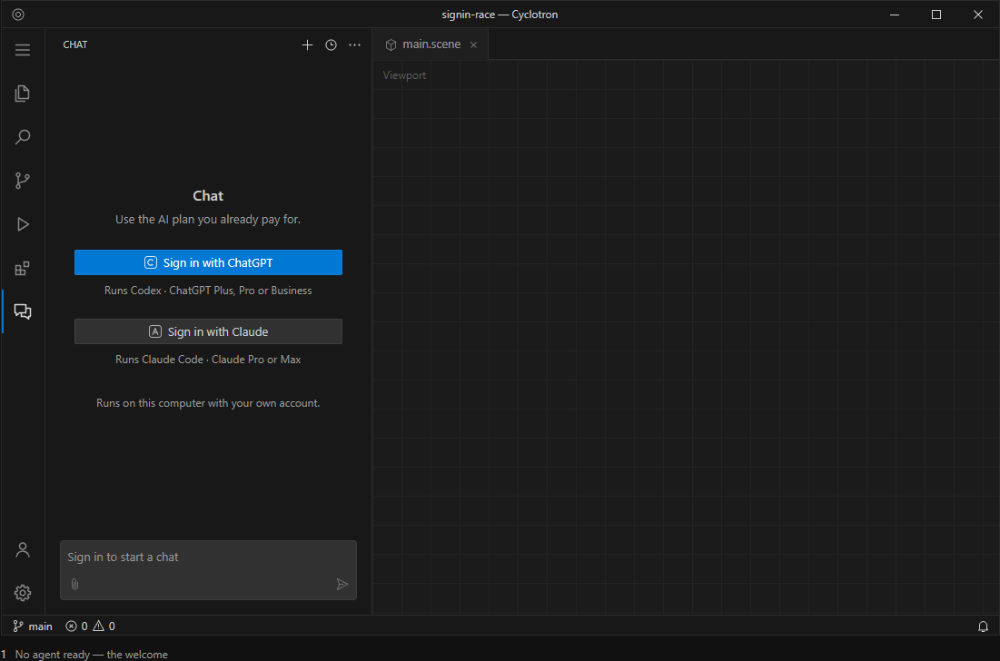
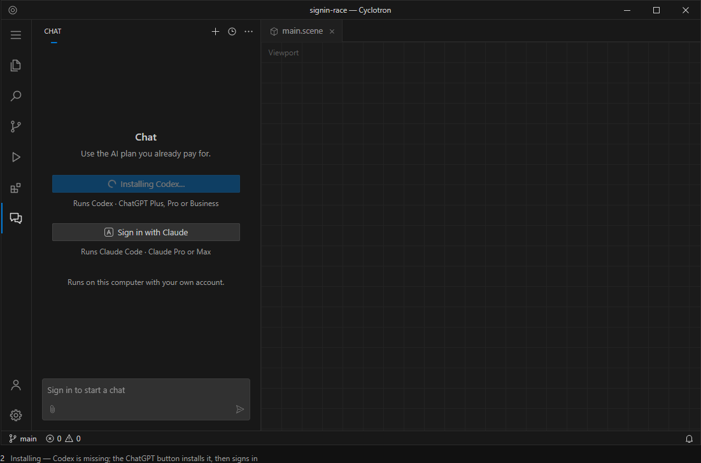
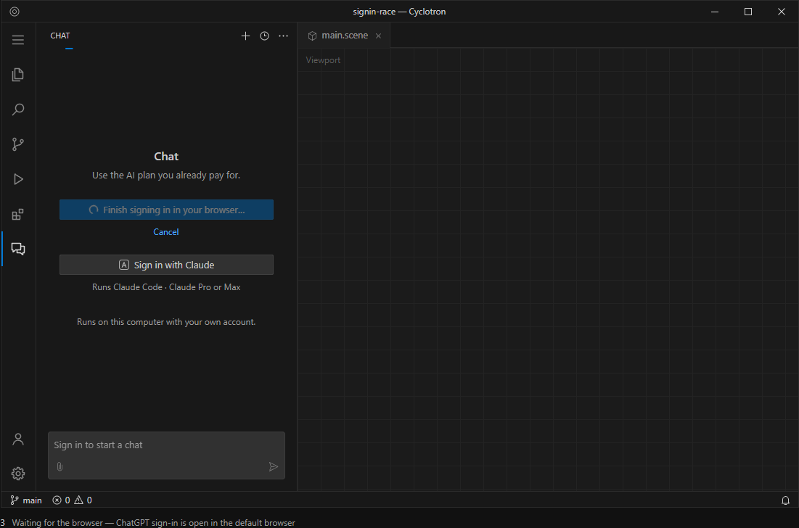
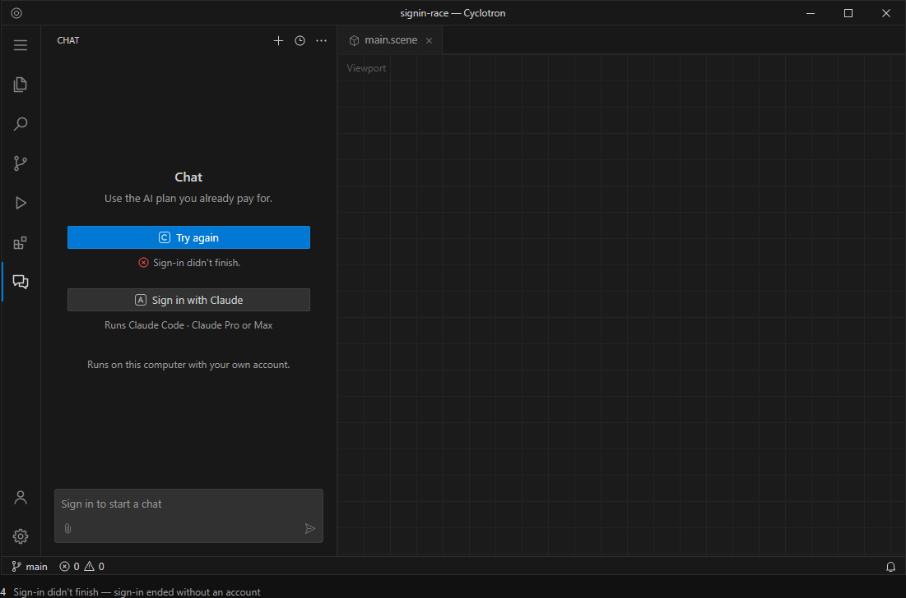
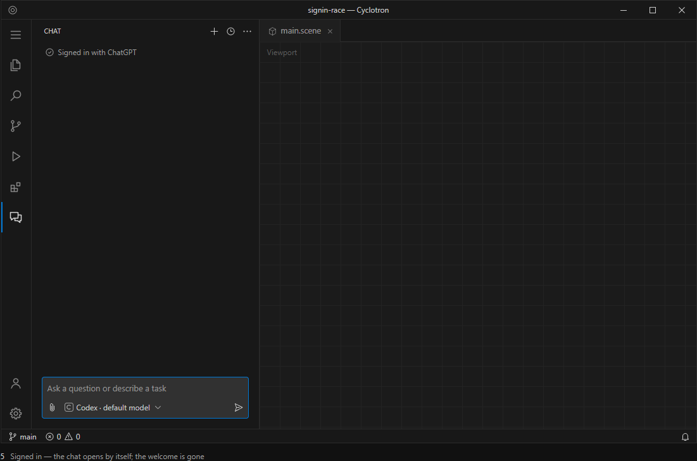
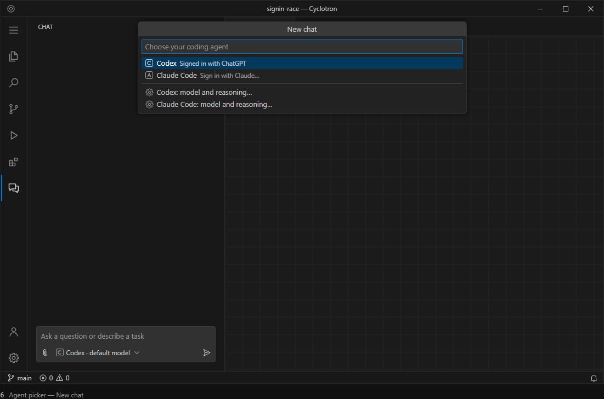

# Chat welcome: sign in with the plan you pay for

The design for Cyclotron's Chat when no coding agent is ready, and for the New chat
agent picker. The owner asked for it on 2026-10-07: today's welcome is verbose, and it
doesn't say what the options are.

The implementation belongs to the Chat frontend in the supercode repository
(`sdk/frontend-vscode/src/chat-setup.ts`, `setupWelcome`, and the agent picker in its
`extension.ts`). Only the fleet coder changes that repository (D228), so this page is
the hand-off: the frames, every string, and the behavior.

[The full mockup](media/chat-welcome-design.html) holds six frames, a strings table and
the behavior rules. Open it in a browser; it is one self-contained file.

## What today's welcome gets wrong

- **Two buttons lead to the same OpenAI account, with different results.** "Sign in with
  ChatGPT" installs OpenAI's separate extension, which opens a second chat panel.
  "Sign in with Codex" signs in the Codex that runs in our Chat. Nothing on screen
  explains the difference.
- **Internal names:** "Supercode · local agents", "the official Codex extension".
- **It narrates the mechanism:** "Each agent opens its own sign-in." "Already signed in?
  Check again."
- **No state:** it doesn't say what is installed, what is signed in, or as whom.

## Decisions

- **The analogy is a "Continue with Google / Continue with Apple" screen.** Each provider
  gets one button, named for the account people pay for (ChatGPT, Claude), not for the
  program behind it.
- **Codex runs in Cyclotron's own Chat**, signed in through its own ChatGPT sign-in in the
  browser. That keeps one chat, with the project's Blender connection, approvals and the
  model picker. OpenAI's separate extension is not on this screen.
- **A missing agent is installed by the same button, then signed in, in one click.** The
  install comes from the vendor's official package: Codex from OpenAI, Claude Code from
  Anthropic.
- **Detection is live, so there is no "Check again".** The button shows progress, and the
  chat opens by itself when sign-in lands, including a sign-in finished in a terminal.
- **No internal names anywhere:** no Supercode, harness, local agents, extension or runtime.

## The frames

| | |
|---|---|
|  1. No agent ready |  2. Installing |
|  3. Waiting for the browser |  4. Sign-in didn't finish |
|  5. Signed in |  6. Agent picker |

## Behavior

- **No agent ready:** the welcome. The composer stays in place, disabled, reading
  "Sign in to start a chat".
- **One agent ready:** the chat opens on it, with no welcome and no picker. This is
  already how it works today.
- **Two or more ready:** the last one used opens. The others are one step away in New chat,
  which lists every agent, signed in or not.
- **Button states:** Sign in → Installing (only when the agent is missing) → Waiting for the
  browser → signed in. A busy button is disabled with a spinner, and the view's progress
  bar runs; the other provider's button stays usable. The line under each button is one
  slot: the caption, then "Cancel", then the error. Nothing below it moves.
- **Cancel and failure:** Cancel returns the button to its start, with no error. If install
  or sign-in ends without a signed-in account, the line reads "Sign-in didn't finish." and
  the button "Try again". The full reason goes to the Chat output log.
- **Picker:** choosing a signed-in agent starts a new chat with it. Choosing a
  "Sign in with …" row runs the same install-and-sign-in flow. The "model and reasoning…"
  rows keep their current behavior.

The host needs, for each agent, whether it is installed, whether it is signed in, and with
what account (when known). Today's `setup.actions` (`login` and `install`) already carry
most of this.

The workbench draws this welcome natively (`scripts/workbench/overlay.mjs`, `patchChatSetupWelcome`)
and reads `supercode.frontend.setupState` only when the welcome renders, so the extension must
re-render it on every setup state change by re-assigning its participant's
`additionalWelcomeMessage`.
