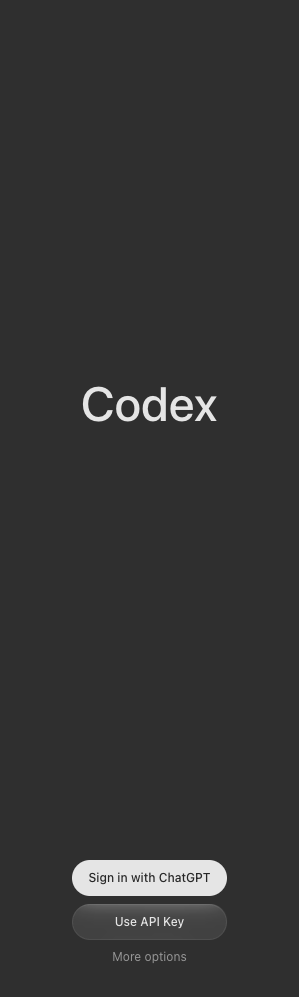

# Codex sidebar and capture evidence

The reported blank Codex sidebar was reproducible in `captureEditorChrome()` while
the live extension webview contained OpenAI's sign-in controls. The capture clones
the workbench DOM into an SVG `foreignObject`; `cloneNode` does not copy an iframe's
browsing context. It returned `ok: true` with a blank rectangle in place of the
working webview. Top-level `document.body.innerText` also excludes that document.
Neither observation establishes that an extension failed to render.

The chrome capture now refuses a visible iframe intersecting its capture region.
Zero-size worker frames, hidden frames and frames outside the region do not block
it. An active-document capture still works when the webview is in the sidebar.
This is a capture correctness fix, not a change to Codex, authentication, the
extension proposal grants or the webview proxy.

## Observed on 2026-10-04

In a throwaway HOME and a separate World, `chatgpt.openSidebar` opened the official
`openai.chatgpt` extension, version `26.5908.31748`. No login was attempted, and
the owner's `~/.codex` was not used. The project used registry Model Editor
`0.5.167` and a release workbench at fork `f16dc165c0df`, editor revision
`3c1e776e77a0`. The release predates #65: its gallery install encountered the
already-fixed signature-verifier error, so this sidebar reproduction installed
the preserved official VSIX through the workbench's CLI.

The workbench's remote extension-host and Codex output logs reported activation,
the bundled app-server's initialize response, and the renderer's routes mounting.
The manifest declares only `chatSessionsProvider` and `languageModelProxy`, both
already granted by the overlay. This run had no missing-proposal error. The older
chat-first-view run had a caught proposal error, but its own logs also showed
app-server initialization and mounted routes; that error does not explain a
blank image from the compositor.

Read-only diagnostics in an isolated copy of the workbench's `pre/index.html`
recorded the inner document's console/CSP events and resource timeline. The hook
checked the parent origin and source; the script's CSP hash was recomputed. No
extension code, resource roots, proxy headers or proposal grants were changed.

- The extension's JavaScript, styles and lazy login modules returned HTTP 200
  through upstream's webview service worker and remote resource loader.
- An early reading was genuinely empty during initialization. A later reading
  contained `Codex`, `Sign in with ChatGPT`, `Use API Key`, `Use device code`, and
  `More options`. Command completion alone is not a rendered-sign-in assertion.
- The extension logged blocked inline-font/eval attempts and Statsig warnings,
  but its sign-in controls rendered. These do not justify relaxing its CSP.
- At that same signed-out state, the existing chrome capture still returned an
  apparently successful image with a blank Codex panel.

[The recorded resource statuses and validation](media/codex-sidebar-evidence.json)
accompany this frame of the extension's own sign-in. The frame is the live inner
DOM with computed styles, serialized and rasterized through the editor eval door;
it is **not a native browser screenshot** and may omit pseudo-elements or canvas
decoration. It was opened and inspected. Native macOS screen capture was
unavailable in the execution environment.

## Validation and limits

The exact new guard was evaluated through `editor.document.run` against the live
chrome and editor-document roots: the page capture was refused and the document
region was allowed. TypeScript 5.9.3 syntax transpilation and the repository's
architecture boundary check passed. No test suites or full product builds ran.

This does not claim to fix an independently observed persistent blank webview,
exercise OAuth, or add iframe pixels to the compositor. It prevents the specific
capture from being presented as successful evidence of a blank live sidebar.
Use the browser's actual window pixels when verifying a whole workbench that
contains extension webviews.
